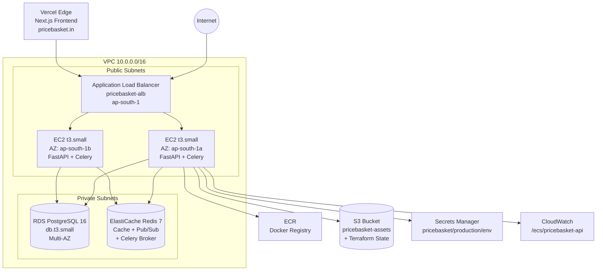
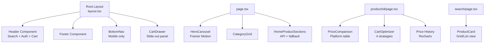
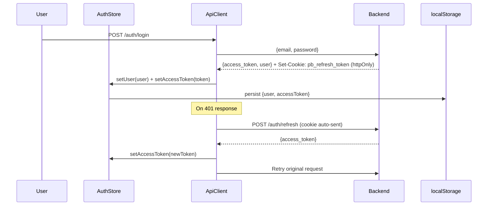

# 01 — PriceBasket Technical Architecture Documentation

> **Classification:** Internal Technical Reference  
> **Version:** 1.0.0  
> **Last Updated:** June 2026  
> **Prepared By:** Architecture Analysis (Auto-generated from source code)

---

## Table of Contents

1. [Executive Summary](#1-executive-summary)
2. [System Overview](#2-system-overview)
3. [Infrastructure Architecture](#3-infrastructure-architecture)
4. [Frontend Architecture](#4-frontend-architecture)
5. [Backend Architecture](#5-backend-architecture)
6. [Mobile App Architecture](#6-mobile-app-architecture)
7. [Database Architecture](#7-database-architecture)
8. [Caching Architecture](#8-caching-architecture)
9. [API Architecture](#9-api-architecture)
10. [Authentication & Security](#10-authentication--security)
11. [Storage Architecture](#11-storage-architecture)
12. [Notification Architecture](#12-notification-architecture)
13. [DevOps Architecture](#13-devops-architecture)
14. [Monitoring & Logging](#14-monitoring--logging)
15. [Scalability Architecture](#15-scalability-architecture)
16. [Disaster Recovery](#16-disaster-recovery)
17. [Cost Optimization](#17-cost-optimization)
18. [Data Flow](#18-data-flow)
19. [Deployment Architecture](#19-deployment-architecture)
20. [Future Improvements](#20-future-improvements)

---

## 1. Executive Summary

### Project Name
**PriceBasket** (`pricebasket.in`)

### Business Purpose
PriceBasket is India's real-time grocery price comparison platform. It aggregates and compares product prices across India's major quick-commerce platforms — Blinkit, Zepto, Swiggy Instamart, BigBasket, JioMart, Amazon Fresh, Flipkart Minutes, and others — enabling consumers to find the cheapest option for every grocery item instantly.

### Problem Statement
India's quick-commerce ecosystem (Blinkit, Zepto, Swiggy Instamart, BigBasket) charges different prices for identical products — sometimes a 20–40% difference. Consumers have no single tool to compare prices across all platforms simultaneously, leading to overpayment of ₹500–₹2,000 per month per household.

### Solution Overview
PriceBasket solves this by:
1. **Scraping** real-time prices from all major platforms every 3–5 minutes via async web scrapers (Playwright + httpx)
2. **Caching** results in Redis for sub-second response times
3. **Presenting** a unified comparison UI with smart badges (Cheapest 🟢 / Fastest ⚡ / Best Value ⭐)
4. **Optimizing** multi-item carts across platforms to maximize savings
5. **Alerting** users when prices drop below their target via email and push notifications

### Key Features

| Feature | Implementation |
|---|---|
| Real-time Price Comparison | Playwright scrapers + Redis cache (3–5 min refresh) |
| Smart Cart Optimizer | 4 strategies: Cheapest Single, Fastest, Cheapest Split, Best Value Split |
| WebSocket Price Push | Live price updates without page refresh via Redis pub/sub |
| Price Drop Alerts | User-configured targets → email + FCM push on trigger |
| AI Highlights | Weighted scoring: 70% price + 30% delivery speed |
| Voice Search | Browser SpeechRecognition API |
| Price History Charts | 30-day Recharts line chart per product per platform |
| Guest Cart | Works without login via session ID cookie |
| Admin Dashboard | Platform CRUD, product management, real-time stats |
| SEO Content Engine | Automated blog/deal content generation + IndexNow submission |
| Flutter Mobile App | WebView shell wrapping the Next.js PWA |

### Target Users
- **Primary:** Indian urban consumers aged 22–45 who order groceries from quick-commerce apps
- **Secondary:** Price-conscious households in Tier-1 cities (Mumbai, Delhi, Bangalore, Hyderabad, Chennai, Pune, Kolkata)
- **Tertiary:** Admin users managing the platform catalog and analytics

---

## 2. System Overview

### High-Level Architecture

```
┌─────────────────────────────────────────────────────────────────────────┐
│                         CLIENT LAYER                                     │
│                                                                           │
│  ┌──────────────────────┐    ┌──────────────────────────────────────┐   │
│  │  Flutter Mobile App  │    │   Browser (Next.js 14 PWA)           │   │
│  │  (iOS + Android)     │    │   pricebasket.in / dev.pricebasket.in│   │
│  │  WebView Shell       │    │   Vercel Edge Network (CDN)          │   │
│  └──────────┬───────────┘    └──────────────┬───────────────────────┘   │
└─────────────┼────────────────────────────────┼───────────────────────────┘
              │ HTTPS + WSS                     │ HTTPS + WSS
              ▼                                 ▼
┌─────────────────────────────────────────────────────────────────────────┐
│                         AWS ap-south-1                                   │
│                                                                           │
│  ┌──────────────────────────────────────────────────────────────────┐   │
│  │  Application Load Balancer (pricebasket-alb)                     │   │
│  │  HTTP :80 → HTTPS :443 (ACM Certificate)                         │   │
│  └──────────────────────────┬───────────────────────────────────────┘   │
│                             │                                             │
│  ┌──────────────────────────▼───────────────────────────────────────┐   │
│  │  EC2 Auto Scaling Group (t3.small, min:1 max:3)                  │   │
│  │  FastAPI (uvicorn × 2 workers) + Celery Worker+Beat              │   │
│  │  Port 8000                                                        │   │
│  └──────────┬──────────────────────────────────────────────────────┘   │
│             │                                                             │
│  ┌──────────▼──────────┐    ┌──────────────────────────────────────┐   │
│  │  RDS PostgreSQL 16   │    │  ElastiCache Redis 7.x               │   │
│  │  (Private Subnet)    │    │  (Private Subnet)                    │   │
│  │  db.t3.small         │    │  DB0: Cache, DB1: Celery Broker      │   │
│  │  Multi-AZ (prod)     │    │  DB2: Celery Results                 │   │
│  └─────────────────────┘    └──────────────────────────────────────┘   │
│                                                                           │
│  ┌──────────────────────────────────────────────────────────────────┐   │
│  │  Celery Workers (price refresh, notifications, marketing)        │   │
│  │  Beat Scheduler (every 5 min price refresh, 10 min alerts)       │   │
│  └──────────────────────────────────────────────────────────────────┘   │
│                                                                           │
│  ┌──────────────────────────────────────────────────────────────────┐   │
│  │  Scraper Registry (async httpx + Playwright Chromium)            │   │
│  │  Blinkit · Zepto · BigBasket · Instamart · JioMart               │   │
│  │  Amazon · Flipkart · Nykaa · Myntra · Dunzo                      │   │
│  └──────────────────────────────────────────────────────────────────┘   │
└─────────────────────────────────────────────────────────────────────────┘
```

### Complete Technology Stack

#### Frontend Technologies

| Technology | Version | Purpose |
|---|---|---|
| Next.js | 14.2.3 (App Router) | React framework, SSR/SSG, routing |
| React | 18.3.1 | UI component library |
| TypeScript | 5.9.3 | Type safety |
| Tailwind CSS | 3.4.4 | Utility-first CSS framework |
| Zustand | 4.5.2 | Global state management (auth, cart) |
| TanStack React Query | 5.40.0 | Server state, caching, background refetch |
| Axios | 1.7.2 | HTTP client with interceptors |
| Recharts | 2.12.7 | Price history charts |
| Framer Motion | 11.2.12 | Animations (HeroCarousel) |
| Swiper | 11.1.4 | Carousel component |
| Lucide React | 0.395.0 | Icon library |
| React Hot Toast | 2.4.1 | Toast notifications |
| Headless UI | 2.1.1 | Accessible UI primitives |
| Vercel | Latest | Hosting, CDN, edge functions |

#### Backend Technologies

| Technology | Version | Purpose |
|---|---|---|
| Python | 3.11+ | Runtime |
| FastAPI | 0.111.0 | Async REST API framework |
| Uvicorn | 0.29.0 | ASGI server (2 workers) |
| SQLAlchemy | 2.0.30 | Async ORM |
| asyncpg | 0.29.0 | Async PostgreSQL driver |
| Alembic | 1.13.1 | Database migrations |
| Redis (asyncio) | 5.0.4 | Cache client |
| Celery | 5.4.0 | Distributed task queue |
| Playwright | 1.44.0 | Headless browser scraping |
| httpx | 0.27.0 | Async HTTP client |
| BeautifulSoup4 | 4.12.3 | HTML parsing |
| python-jose | 3.3.0 | JWT encoding/decoding |
| bcrypt | 4.1.0 | Password hashing |
| Pydantic v2 | 2.7.1 | Data validation |
| structlog | 24.2.0 | Structured JSON logging |
| Sentry SDK | 2.3.1 | Error tracking |
| firebase-admin | 6.5.0 | FCM push notifications |
| boto3 | 1.34.114 | AWS SDK |
| Prometheus Instrumentator | 7.0.0 | Metrics exposure |
| Apify Client | 1.7.0 | Apify actor integration |

#### Mobile Technologies

| Technology | Version | Purpose |
|---|---|---|
| Flutter | Latest stable | Cross-platform mobile framework |
| Dart | Latest stable | Programming language |
| flutter_riverpod | Latest | State management |
| webview_flutter | Latest | WebView rendering |
| firebase_messaging | Latest | FCM push notifications |
| flutter_local_notifications | Latest | Local notification display |
| flutter_secure_storage | Latest | Encrypted JWT/token storage |
| url_launcher | Latest | External URL handling |
| shared_preferences | Latest | Onboarding state persistence |
| http | Latest | Native HTTP calls (FCM token registration) |

#### Database Technologies

| Technology | Version | Purpose |
|---|---|---|
| PostgreSQL | 16 | Primary relational database |
| Redis | 7.x | Cache, pub/sub, Celery broker/backend |

#### Cloud Technologies

| Service | Purpose |
|---|---|
| AWS EC2 (t3.small) | Backend API + Celery worker hosting |
| AWS Auto Scaling Group | Horizontal scaling (min:1, max:3) |
| AWS Application Load Balancer | Traffic distribution, health checks |
| AWS RDS PostgreSQL 16 | Managed database (Multi-AZ in prod) |
| AWS ElastiCache Redis 7 | Managed cache + message broker |
| AWS ECR | Docker image registry |
| AWS Secrets Manager | Secrets storage (DATABASE_URL, SECRET_KEY, etc.) |
| AWS SSM Parameter Store | SMTP configuration |
| AWS CloudWatch | Container logs (/ecs/pricebasket-api) |
| AWS S3 | Static assets, Terraform state |
| Vercel | Frontend hosting, CDN, edge network |

#### Third-Party Integrations

| Service | Purpose |
|---|---|
| Firebase Cloud Messaging (FCM) | Mobile push notifications |
| SMTP (Gmail/AWS SES) | Email notifications (price alerts, password reset) |
| Apify | Managed scraping actors (Blinkit) |
| Sentry | Error tracking and alerting |
| Telegram Bot API | Deploy notifications, deal broadcasts |
| Twitter/X API v2 | Social media automation |
| Meta Graph API | Facebook/Instagram automation |
| WhatsApp Business Cloud API | Deal broadcast to subscribers |
| IndexNow (Bing/Yandex) | Instant search engine indexing |
| Google Search Console | SEO monitoring |
| Lighthouse CI | Performance auditing |

---

## 3. Infrastructure Architecture

### Cloud Provider
**AWS (Amazon Web Services)** — Region: `ap-south-1` (Mumbai)

### AWS Account
- **Account ID:** `443414059511`
- **Primary Region:** `ap-south-1` (Mumbai)

### VPC Architecture

```
VPC: vpc-0a41d6ec89091ea0b (10.0.0.0/16)
│
├── Public Subnets (Internet-facing)
│   ├── pricebasket-public-1a  (subnet-0d943df69c1294238)  — AZ: ap-south-1a
│   └── pricebasket-public-1b  (subnet-0fbf96dac51836079)  — AZ: ap-south-1b
│
└── Private Subnets (Internal only)
    ├── pricebasket-private-1a (subnet-0eb29d7f068e4766c)  — AZ: ap-south-1a
    └── pricebasket-private-1b (subnet-0e8db26a710cd450a)  — AZ: ap-south-1b
```

### Security Groups

| Security Group | ID | Purpose | Inbound Rules |
|---|---|---|---|
| pricebasket-alb-sg | sg-023060588da4926dc | ALB traffic | 80/443 from 0.0.0.0/0 |
| pricebasket-ec2-sg | (created by setup-ec2.sh) | EC2 instances | 22 from 0.0.0.0/0, 8000 from ALB SG |
| pricebasket-rds-sg | sg-0be9e5eb61e740c04 | RDS PostgreSQL | 5432 from EC2 SG |
| pricebasket-redis-sg | sg-07f0170c8b325ca76 | ElastiCache Redis | 6379 from EC2 SG |

### Infrastructure Diagram



### ECS Fargate Task Definitions (Alternative Deployment)

The project also includes ECS Fargate task definitions for containerized deployment:

| Task | CPU | Memory | Image |
|---|---|---|---|
| pricebasket-api (prod) | 1024 (1 vCPU) | 2048 MB | 443414059511.dkr.ecr.ap-south-1.amazonaws.com/pricebasket-api:latest |
| pricebasket-api (dev) | 512 (0.5 vCPU) | 1024 MB | 443414059511.dkr.ecr.ap-south-1.amazonaws.com/pricebasket-api:dev |
| pricebasket-worker | NOT FOUND IN SOURCE CODE / INFRASTRUCTURE (task-def-worker.json exists but not read) | — | — |

### Auto Scaling Configuration

| Parameter | Value |
|---|---|
| Min Instances | 1 |
| Max Instances | 3 |
| Desired Capacity | 1 |
| Scale-Out Trigger | CPU > 70% |
| Scale-In | Enabled |
| Health Check Grace Period | 900 seconds |
| Health Check Path | `/health` |
| Health Check Interval | 30 seconds |

### Terraform State

- **S3 Bucket:** `pricebasket-terraform-state`
- **Versioning:** Enabled
- **Encryption:** AES256
- **Public Access:** Blocked
- **Terraform Modules:** `infra/terraform/modules/alb/`, `infra/terraform/modules/rds/`

---

## 4. Frontend Architecture

### Folder Structure

```
frontend/
├── src/
│   ├── app/                          # Next.js 14 App Router pages
│   │   ├── page.tsx                  # Homepage (SEO-optimized)
│   │   ├── layout.tsx                # Root layout (Header, Footer, providers)
│   │   ├── providers.tsx             # React Query + Toast providers
│   │   ├── globals.css               # Global styles
│   │   ├── sitemap.ts                # Dynamic XML sitemap
│   │   ├── product/[id]/             # Product detail page
│   │   ├── search/                   # Search results page
│   │   ├── cart/                     # Cart page
│   │   ├── auth/                     # Login, Signup, Forgot/Reset Password
│   │   ├── alerts/                   # Price alerts management
│   │   ├── profile/                  # User profile
│   │   ├── admin/                    # Admin dashboard (protected)
│   │   │   ├── analytics/            # Analytics dashboard
│   │   │   ├── catalog/              # Product catalog management
│   │   │   ├── platforms/            # Platform management
│   │   │   ├── users/                # User management
│   │   │   ├── growth/               # Growth metrics dashboard
│   │   │   └── database/             # DB overview
│   │   ├── compare/[matchup]/        # Platform comparison pages (SEO)
│   │   ├── grocery-prices-[city]/    # City-specific price pages (SEO)
│   │   ├── cheapest-[product]-online/# Product-specific SEO pages
│   │   ├── blog/                     # Blog listing + articles
│   │   ├── deals/[platform]/         # Platform deals pages
│   │   └── api/v1/[...path]/         # Vercel proxy → FastAPI backend
│   ├── components/                   # Reusable UI components
│   │   ├── Header/                   # Top navigation + search bar
│   │   ├── BottomNav/                # Mobile bottom navigation
│   │   ├── SearchBar/                # Voice + text search
│   │   ├── ProductCard/              # Product listing card
│   │   ├── PriceComparison/          # Cross-platform price table
│   │   ├── CartDrawer/               # Slide-out cart panel
│   │   ├── CartOptimizer/            # Optimization strategy UI
│   │   ├── HeroCarousel/             # Homepage hero banner
│   │   ├── CategoryGrid/             # Category navigation grid
│   │   ├── HomeProductSections/      # Featured products sections
│   │   ├── PlatformLogo/             # Platform brand logos
│   │   ├── ChatBot/                  # AI chatbot widget
│   │   ├── SmartRecommendations/     # AI product recommendations
│   │   └── StructuredData/           # JSON-LD SEO schema
│   ├── hooks/
│   │   ├── useWebSocket.ts           # Real-time price subscription
│   │   ├── useSearch.ts              # Debounced product search
│   │   └── useBackendWakeup.ts       # Backend keep-alive ping
│   ├── store/
│   │   ├── authStore.ts              # Zustand auth state (persisted)
│   │   ├── cartStore.ts              # Zustand cart state (optimistic)
│   │   └── locationStore.ts          # User location state
│   ├── services/
│   │   └── api.ts                    # Axios client + interceptors + event tracking
│   ├── lib/
│   │   ├── mockData.ts               # Demo products/categories (fallback)
│   │   ├── platforms.ts              # Platform metadata
│   │   ├── server-api.ts             # Server-side API calls (SSR)
│   │   ├── analytics.ts              # Analytics helpers
│   │   ├── blog.ts                   # Blog content helpers
│   │   ├── city-product-data.ts      # City-specific SEO data
│   │   └── deals-data.ts             # Deals page data
│   ├── types/
│   │   └── index.ts                  # Shared TypeScript interfaces
│   └── middleware.ts                 # Next.js middleware (auth guards)
├── public/                           # Static assets
├── next.config.js                    # Next.js configuration
├── vercel.json                       # Vercel deployment config
├── tailwind.config.ts                # Tailwind theme (orange brand)
└── package.json
```

### Component Architecture



### State Management

| Store | Library | Persistence | Purpose |
|---|---|---|---|
| `authStore` | Zustand + persist | localStorage (`pb_auth`) | User session, access token |
| `cartStore` | Zustand + persist | localStorage (`pb_cart_meta`) | Cart items, total count |
| `locationStore` | Zustand | Memory only | User city/pincode |
| Server State | TanStack React Query | Memory + stale-while-revalidate | API data caching |

### Authentication Flow (Frontend)



### API Communication

- **Base URL:** `NEXT_PUBLIC_API_URL` env var (empty = relative URL via Vercel proxy)
- **Proxy:** Vercel rewrites `/api/v1/*` → FastAPI backend (ALB)
- **Auth:** Bearer token injected by Axios request interceptor
- **Guest:** `X-Session-ID` header from `localStorage.pb_session_id`
- **Token Refresh:** Automatic via Axios response interceptor on 401
- **Event Tracking:** Fire-and-forget `POST /api/v1/analytics/event`

### SEO Architecture

The frontend implements extensive SEO:
- **Static pages:** City-specific (`/grocery-prices-mumbai`), product-specific (`/cheapest-atta-online`), comparison (`/compare/blinkit-vs-zepto`)
- **Dynamic sitemap:** `app/sitemap.ts` fetches all product slugs from API
- **Structured data:** JSON-LD (FAQPage, WebSite, SearchAction, Product)
- **Open Graph + Twitter Cards** on all pages
- **IndexNow:** Submitted on every production deploy
- **Cache-Control headers:** Configured in `vercel.json` per route type

---

## 5. Backend Architecture

### Application Structure

```
backend/
├── app/
│   ├── main.py              # App factory, middleware registration, lifespan
│   ├── config.py            # Pydantic Settings (env-validated)
│   ├── database.py          # Async SQLAlchemy engine + session factory
│   ├── api/v1/
│   │   ├── auth.py          # Register, Login, Refresh, Logout, Forgot/Reset Password
│   │   ├── products.py      # Search, Featured, Categories, Bulk, Buy redirect
│   │   ├── prices.py        # Real-time prices, History, Alerts CRUD
│   │   ├── cart.py          # Cart CRUD + Optimization
│   │   ├── users.py         # Profile update, FCM token registration
│   │   ├── admin.py         # Platform/product management, stats
│   │   ├── analytics.py     # Event tracking, stats, client journey
│   │   ├── websocket.py     # WS price push + Redis pub/sub
│   │   ├── content.py       # SEO content generation
│   │   ├── growth.py        # Growth metrics dashboard
│   │   ├── app_meta.py      # App version/config endpoint
│   │   └── setup.py         # Admin bootstrap endpoint
│   ├── models/
│   │   ├── user.py          # User, OAuth fields, FCM token
│   │   ├── product.py       # Product, Category
│   │   ├── platform.py      # Platform (Blinkit, Zepto, etc.)
│   │   ├── price.py         # PlatformPrice, PriceHistory, PriceAlert
│   │   ├── cart.py          # Cart, CartItem, Wishlist, RefreshToken
│   │   └── analytics.py     # UserEvent
│   ├── schemas/             # Pydantic v2 request/response schemas
│   ├── services/
│   │   ├── auth_service.py       # JWT, bcrypt, token rotation
│   │   ├── price_engine.py       # Fan-out scrape + Redis cache
│   │   ├── cart_optimizer.py     # 4-strategy optimization (pure computation)
│   │   ├── notification_service.py # Email + FCM push
│   │   ├── push_notification_service.py # Firebase Admin SDK
│   │   ├── product_intelligence.py # Normalized names, scoring, affiliate URLs
│   │   ├── content_engine.py     # SEO content generation
│   │   ├── deals.py              # Deal detection
│   │   ├── seo_ping.py           # IndexNow submission
│   │   └── social_poster.py      # Social media automation
│   ├── scrapers/
│   │   ├── base_scraper.py       # Abstract base class
│   │   ├── blinkit_scraper.py    # Playwright + network interception
│   │   ├── zepto_scraper.py      # Playwright/httpx
│   │   ├── bigbasket_scraper.py  # Playwright/httpx
│   │   ├── instamart_scraper.py  # Playwright/httpx
│   │   ├── jiomart_scraper.py    # Playwright/httpx
│   │   ├── amazon_scraper.py     # Playwright/httpx
│   │   ├── flipkart_scraper.py   # Playwright/httpx
│   │   ├── nykaa_scraper.py      # Playwright/httpx
│   │   ├── myntra_scraper.py     # Playwright/httpx
│   │   ├── dunzo_scraper.py      # Playwright/httpx
│   │   ├── fallback_pricer.py    # Estimated prices fallback
│   │   └── playwright_pool.py    # Shared Chromium browser pool
│   ├── cache/
│   │   └── redis_client.py       # Redis connection + cache helpers
│   ├── middleware/
│   │   ├── auth_middleware.py    # JWT Bearer extraction + validation
│   │   └── rate_limiter.py       # Redis sliding-window rate limiter
│   └── workers/
│       ├── celery_app.py         # Celery app + beat schedule
│       ├── price_update_worker.py # refresh_all_prices, send_price_alerts
│       └── marketing_worker.py   # generate_daily_content, post_daily_deal_social
├── migrations/
│   └── versions/                 # Alembic migration files
├── Dockerfile                    # API container
├── Dockerfile.worker             # Celery worker container
├── requirements.txt
└── alembic.ini
```

### Middleware Stack (Order Matters)

```
Request
  │
  ▼
GZipMiddleware (min_size=1000 bytes)
  │
  ▼
CORSMiddleware (allowed origins: pricebasket.in, vercel.app, localhost)
  │
  ▼
RateLimitMiddleware (Redis sliding window)
  │
  ▼
Prometheus Instrumentator (/metrics endpoint)
  │
  ▼
Request Logging Middleware (structlog JSON)
  │
  ▼
Router (auth, products, prices, cart, admin, analytics, ws, ...)
