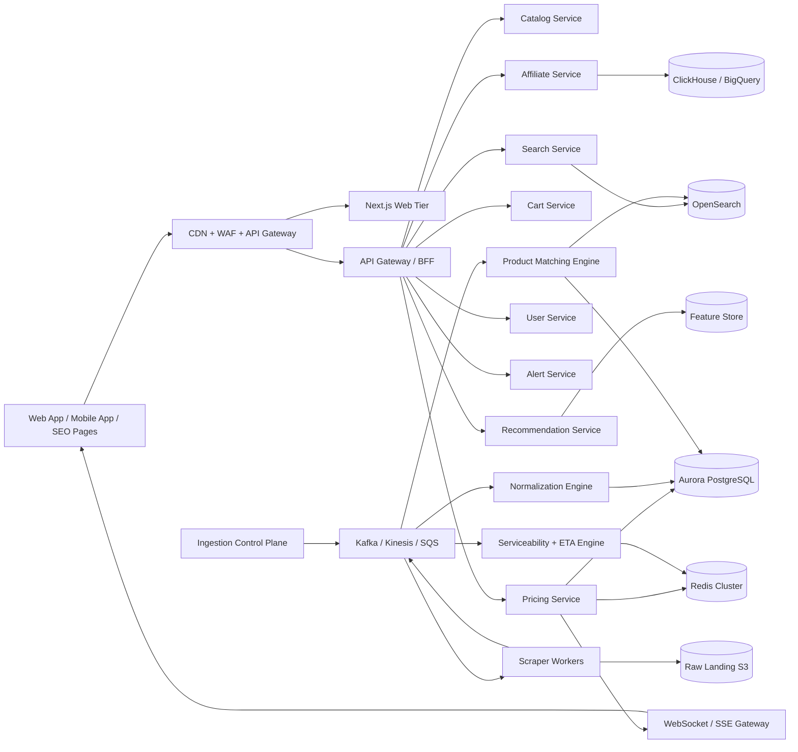
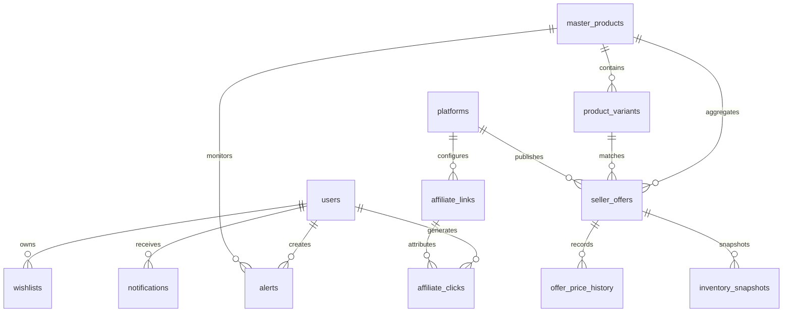
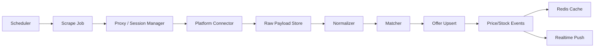

# PriceBasket Enterprise Architecture

## 1. Executive Summary

PriceBasket should evolve from the current FastAPI + Next.js monolith into an event-driven commerce intelligence platform optimized for Indian quick-commerce comparison, affiliate conversion, and nationwide low-latency search.

The current repository already provides a solid monolith baseline:

- FastAPI APIs for auth, products, prices, carts, admin, and WebSocket streaming
- Next.js app-router frontend with cart, search, auth, and product pages
- PostgreSQL, Redis, Celery, Prometheus, and Terraform scaffolding

The missing enterprise-grade capabilities are:

- platform onboarding beyond the initial four providers
- canonical product matching and catalog normalization
- geo-aware availability and ETA computation
- affiliate link routing and click attribution
- queue-first scraping and ingestion orchestration
- search ranking, autocomplete, synonyms, and recommendations
- service decomposition for large-scale traffic and multi-city data freshness

This document defines the target architecture, migration plan, APIs, data model, operating model, and rollout sequence.

## 2. Current-State Assessment

### Strengths

- Good monolith foundation for rapid iteration
- Async backend stack with Redis and Celery already in place
- Real-time browser update path via WebSocket already started
- Platform and price entities already model comparison use cases

### Gaps

- Product model is catalog-centric, not master-product plus seller-offer centric
- Search is SQL `ILIKE`, not an indexed relevance engine
- Scrapers are synchronous to product lookups instead of queue-managed ingestion jobs
- Affiliate tracking is not modeled as a first-class domain
- No pincode-level serviceability, city partitioning, or ingestion freshness SLAs
- No clickstream, recommendation, or analytics event pipeline

## 3. Target System Architecture



## 4. HLD

### User-Facing Planes

- Web app: Next.js SSR/ISR pages for SEO landing pages, search results, and product pages
- Mobile app: React Native or Flutter consuming the same BFF APIs
- Realtime channel: WebSocket or SSE for price refresh, stock changes, and alert delivery

### Core Service Domains

- Catalog Service: master products, variants, brand taxonomy, media, moderation
- Seller Offer Service: platform-specific listings, availability, ETA, offer metadata, affiliate route
- Pricing Service: current best offer, price history, fake discount heuristics, price intelligence
- Search Service: autocomplete, fuzzy matching, synonyms, ranking, personalization features
- Matching Service: product normalization and entity resolution across all platforms
- Affiliate Service: redirect generation, click tracking, partner IDs, conversion reconciliation
- Alert Service: wishlist, saved searches, price alerts, stock alerts, push/email/WhatsApp notifications
- Analytics Service: funnel events, clickstream, platform revenue, scraper health, anomaly detection
- Admin Service: moderation, partner onboarding, failed ingestion review, metrics dashboards

### Control Planes

- Scraper Orchestration: queue scheduling, retries, anti-blocking, geo partitioning
- Platform Connectors: official APIs, browser automation, mobile API adapters, fallback parsers
- Feature Pipeline: trend features, recommendation features, fraud features, freshness metrics

## 5. LLD by Service

### Catalog Service

- Owns `master_products`, `product_variants`, `brands`, `categories`, `product_media`
- Exposes read APIs to search, pricing, and admin
- Stores canonical quantity, pack-size, normalized brand, and moderation state

### Matching Engine

- Input: raw offers from platforms
- Steps:
  1. brand normalization
  2. quantity extraction
  3. token cleanup and synonym expansion
  4. candidate generation using trigram + embedding recall
  5. deterministic rules for barcode and exact pack-size matches
  6. ML scoring for ambiguous pairs
  7. human moderation queue below confidence threshold

### Pricing Service

- Maintains hot cache keyed by `city:pincode:master_product_id`
- Computes cheapest seller, fastest seller, best value seller, spread, volatility, fake discount flags
- Publishes change events when price, stock, ETA, or offer changes cross thresholds

### Affiliate Service

- Generates partner URLs and short-lived redirect tokens
- Tracks `click_id`, `session_id`, `user_id`, `campaign`, `platform`, `product`, `city`, `pincode`
- Reconciles postback reports or partner CSVs for commission attribution

### Search Service

- Uses OpenSearch for lexical retrieval
- Uses embeddings and synonym maps for recall expansion
- Uses learning-to-rank features: click-through, add-to-cart, price spread, ETA, stock confidence

## 6. Proposed Repository Evolution

```text
price-basket/
  apps/
    web/
    mobile/
    admin/
  services/
    api-gateway/
    catalog-service/
    pricing-service/
    search-service/
    affiliate-service/
    user-service/
    alert-service/
    analytics-service/
  workers/
    scraper-orchestrator/
    platform-connectors/
    normalization-worker/
    matching-worker/
    notification-worker/
  packages/
    shared-schemas/
    shared-events/
    ui/
    observability/
  infrastructure/
    terraform/
    kubernetes/
    grafana/
    loki/
    prometheus/
  docs/
```

### Migration Strategy

- Phase 1: strengthen the monolith with proper domain boundaries and asynchronous ingestion
- Phase 2: extract search, pricing, and affiliate services
- Phase 3: extract catalog matching and recommendation services
- Phase 4: mobile app, multi-region active-active reads, partner APIs

## 7. Backend API Design

### Public APIs

#### Search

```http
GET /api/v1/search/autocomplete?q=coke&city=delhi&pincode=110001
GET /api/v1/search/products?q=atta&sort=best_value&city=mumbai&pincode=400001
GET /api/v1/products/{master_product_id}
```

#### Pricing

```http
GET /api/v1/prices/{master_product_id}?city=bengaluru&pincode=560001
GET /api/v1/prices/{master_product_id}/history?window=30d
GET /api/v1/prices/{master_product_id}/offers
```

#### Affiliate

```http
GET /api/v1/products/{master_product_id}/buy/{platform_id}
POST /api/v1/affiliate/postback/{partner}
GET /api/v1/affiliate/clicks/me
```

#### Alerts and Wishlist

```http
POST /api/v1/alerts/price
POST /api/v1/alerts/stock
GET /api/v1/wishlist
POST /api/v1/wishlist/items
```

### Admin APIs

- partner health and scrape freshness
- failed matching review queue
- manual product merge and split
- affiliate revenue analytics
- API latency and error monitoring

## 8. Database Design

### Core Tables

- `master_products`
- `product_variants`
- `seller_offers`
- `offer_price_history`
- `inventory_snapshots`
- `platforms`
- `affiliate_links`
- `affiliate_clicks`
- `users`
- `wishlists`
- `alerts`
- `notifications`
- `search_queries`
- `recommendation_events`

### ER Diagram



### Recommended Physical Partitioning

- Partition `offer_price_history` by month and city cluster
- Partition `inventory_snapshots` by day and platform
- Use Redis hashes for hot pincode + product offer sets
- Use OpenSearch for searchable denormalized product documents

## 9. Product Matching Algorithm

### Canonicalization Pipeline

1. Lowercase, transliterate, strip punctuation
2. Expand synonyms: `coca cola -> coke`, `ml -> millilitre`, `gm -> g`
3. Extract structured quantity and unit
4. Normalize brands from dictionary and alias tables
5. Create `variant_signature = brand + family + quantity + pack`

### Matching Strategy

1. Exact match on barcode or partner SKU bridge if available
2. Exact match on normalized brand + quantity + family tokens
3. Approximate recall using trigram/Jaccard candidates
4. Embedding-based semantic similarity on titles and descriptions
5. Weighted confidence score

### Example Score

$$
score = 0.35 \cdot brand + 0.25 \cdot quantity + 0.20 \cdot title + 0.10 \cdot category + 0.10 \cdot image
$$

### Confidence Routing

- `>= 0.92`: auto-merge
- `0.75 - 0.91`: human moderation queue
- `< 0.75`: keep as unmatched offer candidate

## 10. Search Architecture

### Query Flow

1. BFF receives query with city or pincode context
2. Search service expands synonyms and typo candidates
3. OpenSearch retrieves lexical candidates
4. Embedding reranker improves semantic recall
5. Pricing features rerank based on availability, ETA, and best live savings
6. Personalized recommendations modify top results for signed-in users

### Index Shape

- canonical title
- brand aliases
- category hierarchy
- unit normalized fields
- pincode availability counts
- min price, max price, avg ETA
- popularity and click features

## 11. Scraper and Ingestion Architecture

### Connector Priority

1. official APIs
2. public APIs
3. partner feeds
4. reverse-engineered mobile APIs
5. headless browser automation
6. OCR fallbacks only when unavoidable

### Worker Pipeline



### Anti-Blocking Strategy

- rotating residential proxies and ASN diversity
- sticky sessions per city
- device fingerprint rotation
- token bucket rate limiting per platform
- circuit breaker when failure or CAPTCHA rates spike
- queue backoff and regional load shedding

### Failure Handling

- retry with exponential backoff and jitter
- dead-letter queues for parsing failures
- connector quarantine after repeated schema shifts
- alerting when freshness SLA breaches occur by city or platform

## 12. Realtime Architecture

### Event Types

- `offer.updated`
- `offer.stock_changed`
- `offer.eta_changed`
- `alert.triggered`
- `affiliate.click_recorded`

### Delivery Model

- Kafka/Kinesis for durable backbone
- Redis Pub/Sub for edge fanout where acceptable
- WebSocket gateway subscriptions by product, category, and watchlist

### Freshness SLA Targets

- Tier-1 products: 30-90 seconds
- Tier-2 products: 3-5 minutes
- Long-tail products: on-demand refresh plus scheduled backfill

## 13. Security Design

### Application Security

- short-lived JWT access tokens and rotating refresh tokens
- RBAC for admin, analyst, moderator, operator roles
- signed redirect tokens for affiliate flows
- strict CORS, CSP, HSTS, and secure cookies
- secret rotation through AWS Secrets Manager

### Data Security

- encrypt data at rest with KMS
- TLS everywhere
- separate PII stores from clickstream where practical
- audit logs for moderation and admin actions

### Platform Protection

- WAF and bot filtering at edge
- rate limiting per IP, user, device fingerprint, and token
- abuse scoring for scraping endpoint protection and signup fraud

## 14. Scalability Strategy

### Traffic Scaling

- CDN cache for SSR, ISR, and public content
- Redis for hot offer reads
- horizontal autoscaling for BFF, pricing, and WebSocket gateways
- city-partitioned queues to isolate local spikes

### Data Scaling

- hot/cold storage split for live offers vs historical archives
- ClickHouse or BigQuery for analytical events
- monthly partitions for high-write history tables

### Multi-Region Strategy

- primary writes in `ap-south-1`
- read replicas and CDN edges for other regions
- eventual active-active read path for search and pricing caches

## 15. Affiliate Tracking Architecture

### Click Flow

1. user clicks buy CTA
2. BFF mints redirect token with `click_id`
3. redirect service stores click event
4. user lands on partner app or web page with affiliate params
5. partner postback or revenue report reconciles conversion

### Tracking Fields

- `click_id`
- `session_id`
- `user_id`
- `partner`
- `platform_id`
- `master_product_id`
- `city`
- `pincode`
- `campaign`
- `device_type`
- `referrer`

## 16. Monitoring Dashboards

### Operational Dashboards

- API latency, throughput, error rate, saturation
- scraper success rate by platform and city
- cache hit ratio by endpoint
- WebSocket connected clients and fanout lag

### Business Dashboards

- search to click conversion
- click to partner conversion
- revenue by partner, city, category, and campaign
- price spread distribution and top savings products

### Data Quality Dashboards

- unmatched offer rate
- low-confidence match queue depth
- duplicate master product candidates
- stale inventory counts per pincode

## 17. Deployment Guide

### Recommended AWS Stack

- CloudFront + WAF
- ALB + ECS Fargate or EKS
- Aurora PostgreSQL
- ElastiCache Redis Cluster
- MSK or Kinesis
- S3 raw data lake
- OpenSearch
- ClickHouse Cloud or BigQuery equivalent for analytics
- Grafana, Prometheus, Loki, Tempo

### Environments

- dev: single-region monolith + shared managed services
- staging: production-like with partner sandbox integrations
- prod: isolated VPC, autoscaling, regional queue partitions, DR runbooks

### CI/CD

- trunk-based development
- preview environments for frontend
- blue/green or canary for pricing and affiliate services
- migration gates for schema changes with backfill jobs

## 18. Multi-City Scaling Strategy

- Treat `city` and `pincode` as first-class routing keys in APIs, caches, and events
- Maintain offer snapshots per pincode cluster for serviceability-sensitive apps
- Use tiered ingestion schedules by city demand and inventory churn
- Run regionally sticky proxy pools to improve connector quality
- Replicate only top-SKU hot sets aggressively; use on-demand backfill for long tail

## 19. Legal and Compliance

- verify partner and affiliate terms before scraping or redirect monetization
- publish transparent affiliate disclosure on comparison and product pages
- comply with Indian DPDP Act for personal data handling and consent
- honor platform robots, TOS, and legal review gates where required
- provide user controls for notification consent, cookies, and account deletion

## 20. SEO Strategy

- ISR pages for categories, brand hubs, and city landing pages
- schema.org markup for Product, Offer, AggregateOffer, BreadcrumbList, FAQ
- canonical URLs for normalized master products
- fast LCP through CDN images, edge caching, and selective hydration
- long-tail pages such as `best milk delivery in Delhi` and `Blinkit vs Zepto atta prices`

## 21. Revenue Model Strategy

- affiliate commission on redirected orders
- sponsored placements with clearly labeled ads
- premium analytics subscriptions for brands and distributors
- B2B APIs for market intelligence, availability insights, and price trends
- dynamic CPC bidding for category-level campaigns

## 22. Testing Strategy

- unit tests for matching, ranking, affiliate URL generation, and ETA scoring
- contract tests for partner connectors and BFF schemas
- replay tests against captured raw payloads after parser changes
- load tests for search, pricing fanout, and WebSocket subscriptions
- chaos tests for queue failures, Redis loss, and scraper outages

## 23. Cost Estimate

### Early Scale: 100k MAU

- web + api + workers: $1.5k-$3k/month
- databases, cache, search, storage: $2k-$4k/month
- proxies, CAPTCHA, observability: $1k-$3k/month

### Growth Scale: 1M+ MAU

- application and queue tier: $8k-$20k/month
- Aurora, Redis, OpenSearch, analytics: $12k-$35k/month
- proxy and anti-bot infra: $10k-$40k/month

Primary cost drivers are scraping coverage breadth, freshness SLA, and analytics retention.

## 24. Implementation Roadmap

### Phase 0: Stabilize Current Monolith

1. Finish schema hardening for master products, seller offers, and affiliate clicks
2. Move on-demand price fetches behind queue-backed refresh jobs
3. Add city and pincode request context everywhere
4. Replace basic SQL search with OpenSearch-backed autocomplete and search results

### Phase 1: Intelligence Foundations

1. Build normalization dictionaries and quantity extraction library
2. Introduce product matching confidence scores and moderation queue
3. Add offer freshness metrics and scrape health dashboards
4. Release affiliate redirect and click logging service

### Phase 2: Scale Platform Coverage

1. Prioritize official API and partner feeds
2. Add connector SDK for Blinkit, Zepto, Instamart, BigBasket, Flipkart Minutes, JioMart
3. Expand to pharma and specialty apps after category-specific validation
4. Add multi-city sticky sessions and geo-aware proxies

### Phase 3: Realtime and Personalization

1. Publish price and stock change events
2. Add watchlists, recommendations, and push notifications
3. Launch trend predictions and fake discount detection
4. Introduce city-specific ranking and user personalization

### Phase 4: Service Extraction

1. Extract search service
2. Extract pricing service
3. Extract affiliate service
4. Extract matching and recommendation services

## 25. Codebase Changes Added in This Iteration

The repository now includes a first production-aligned step toward the target model:

- product intelligence derivation for normalized names, quantity extraction, and price spread
- affiliate-aware buy URL generation via backend redirect endpoint
- richer product contract surfaced to the frontend product detail page

These changes are not the complete platform, but they move the existing codebase toward the target enterprise architecture without forcing a premature rewrite.
